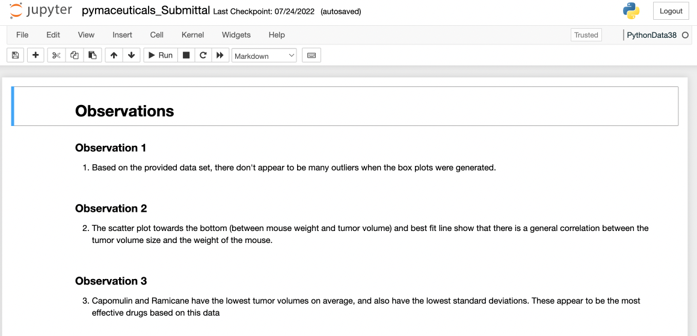
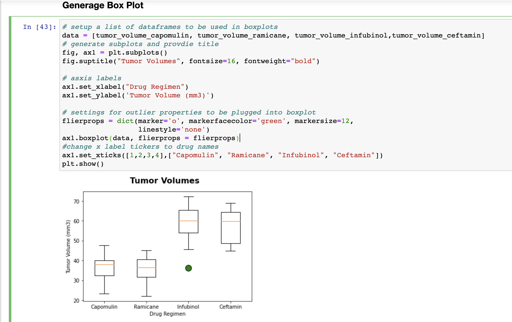

Summary/Problem: The repo contains documenation to create a set of plots to help analyze a dataset based on pharmaceutical informaiton. We are trying to figure out which drugs are the most effective at treating tumors.

See Below snapshot for observations from Data.

## Info

1. The pymaceuticals folder contains the following:
    + the data folder with the CSV files that are being read into the notebook
    + the starter file that was provided is included as a reference.
    + **the Submittal.ipynb file contains the code
2. The repo contains the .gitingore and README.md (this document)

***

### Additional Info
The Submittal jupyter notebook has the observations on the top of the notebook and the required code supporting those observations are below the observations.
